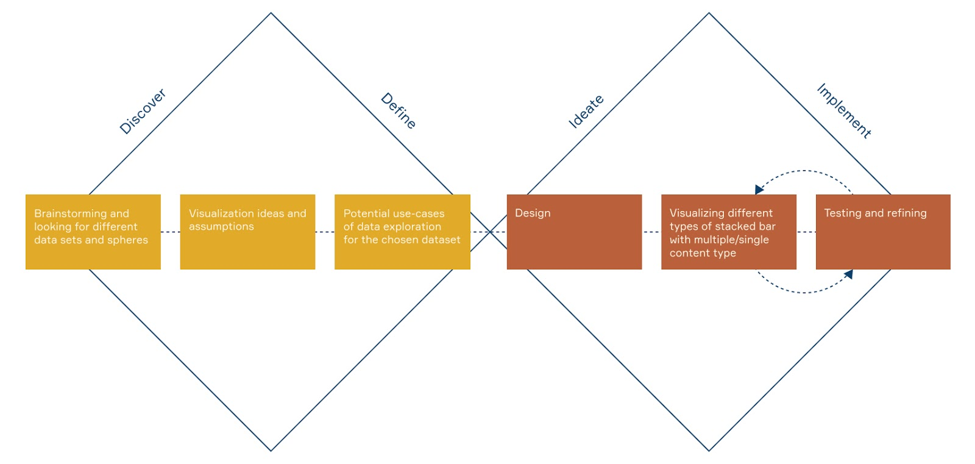

# A3 Writeup

## Link to dataset

https://www.kaggle.com/swoolfeek/starbucks-nutrition-with-sugar-and-etc#starbucks_drink.csv

## Short description

Tool for exploration and comparison of Starbucks drinks’ nutrition content based on size, milk type, and additional toppings such as whipped cream.

## Team

We spent about 60 hours developing our application.

- Thomas Fuller: data formatting/organization, data loading/querying, selectors

- Erica Eaton and Dylan Chan: the bar charts (creation and styling, displaying data, and creating tooltips)

- Olga Khvan: UX/UI design, HTML/CSS stylization

Since it was Erica and Dylan’s first time working with D3, writing the code for the bar charts took a lot of time. Some of the challenges faced while creating the bar charts were determining the correct values for the y and height attributes for each bar, displaying stacked bars, and styling the charts such that they are easy to read, do not overlap, and do not have the values on the y-axis partially cut off (i.e. seeing only “20” in a tick mark labeled “120” on the y-axis).

## Process

## Rationale for design decisions (visual encodings and interactions)

Since people customize drinks at Starbucks, it is difficult to know the nutritional content of specific, customized drinks. Size, milk type, and whipped cream all affect the nutritional content of a drink. Thus, we wanted to create a tool to visualize the differences in two Starbucks drinks’ nutritional content. We created selectors for drink customizations that affect the drinks’ nutritional content and that we had data for. We decided to only display selectors for two drinks to allow for simple comparison and avoid clutter.

We chose to use bar charts because they make it easier to compare two different values and clearly show which drink has a larger amount of a specific nutritional content. Moreover, we decided to create one bar chart for each type of nutritional content because most people only compare the same nutritional content types with each other. Also, some nutritional contents have different units and different scales.

We ordered the charts to roughly correspond with the ordering of nutrition facts on food product labels as this is what we anticipate our audience to be familiar with.
We broke some nutritional categories down further. For example, calories are broken down into “Calories” and “Calories from Fat”. In addition, fat is broken down into “Fat”, “Saturated Fat”, and “Trans Fat”. We used a stacked bar chart to encode these distinctions. Since “Calories from Fat” is a subcategory of “Calories”, we use a bar to show the total calories, and the portion of calories that come from fat are a different shade to highlight the difference (we used this same technique for the chart displaying fat). Tooltips were added to make this more clear and show the exact values.

Last, we decided to add animation to the bar charts whenever a user changes part of their selection. The reason is that when changing a selection, the physical height of a bar may appear to stay the same, but the scale on the y-axis changed, so that bar does not encode the same value. Without animation, a user may not notice the change in scale and could infer that the value of that particular nutrition content stayed the same despite their selection changing.

## Rationale for visual design and layout

The warm color palette was inspired by the color of coffee drinks and we chose the other colors (blue and yellow) to contrast with that color palette. In regards to the layout, we placed the selectors on the left and the bar charts on the right, mainly to follow convention and thereby leverage users' previous experiences to assume how they might interact with our tool as well. Specifically, since many GUI based software have a toolbar on the left (i.e. Tableau, Google Maps, Microsoft Outlook, Finder/Windows Explorer), we opted to put our selectors in the same location.
